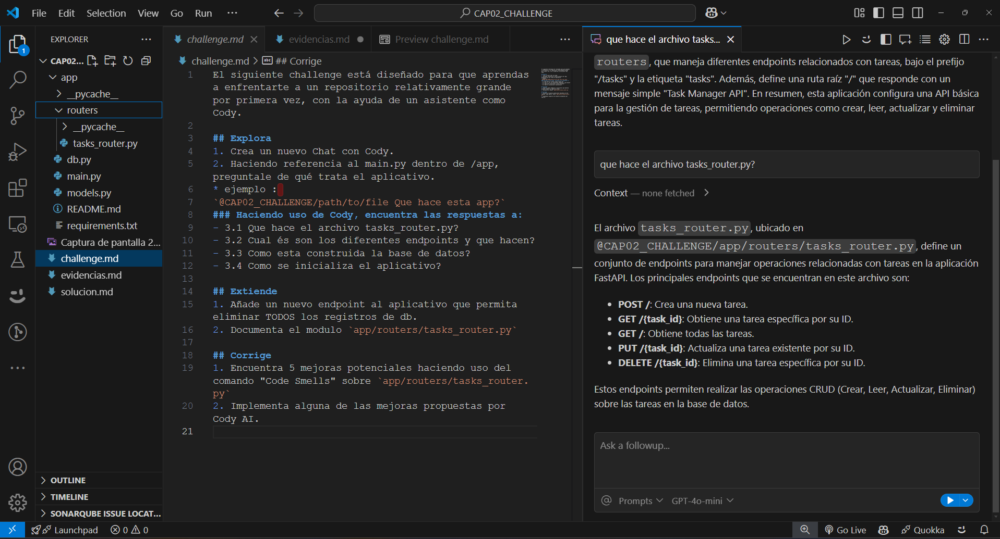
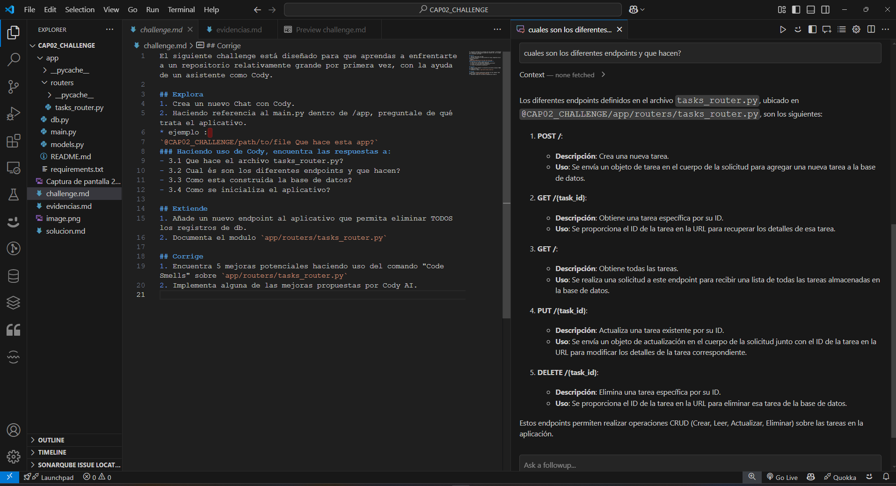
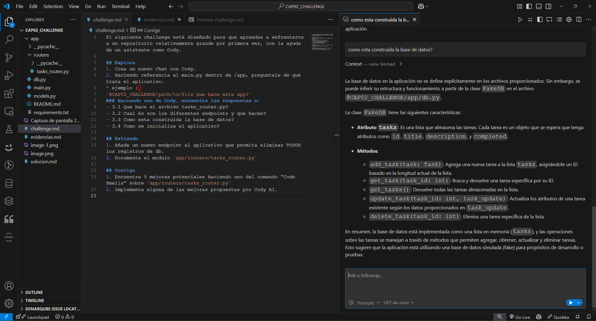
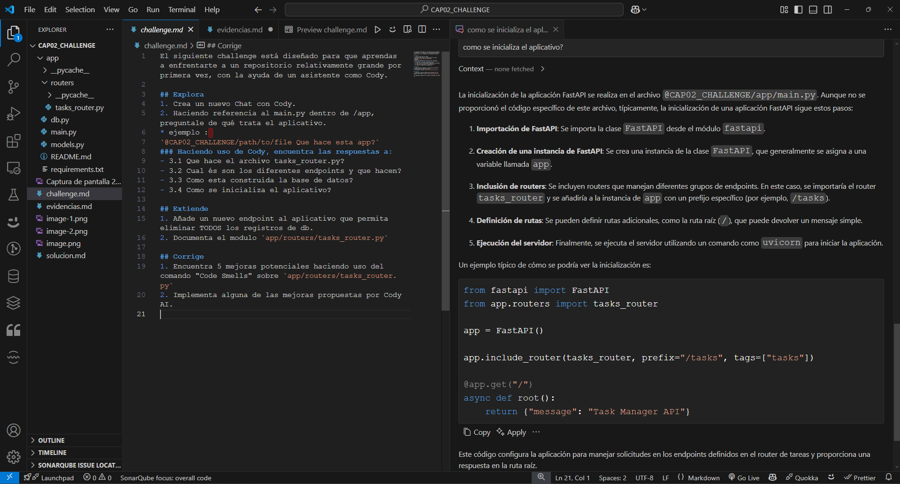
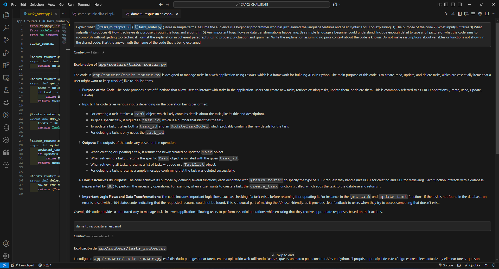
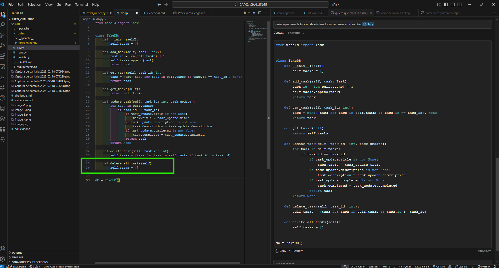
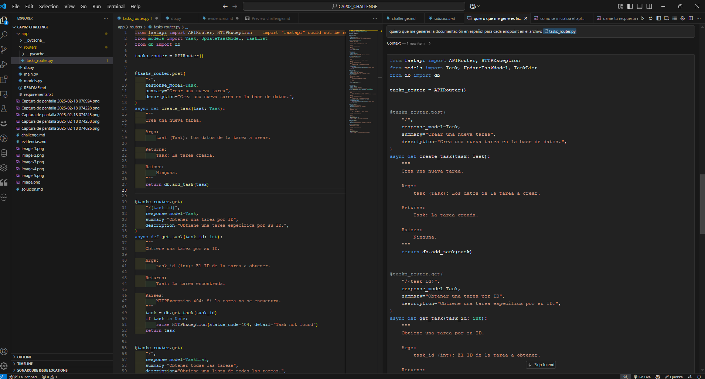
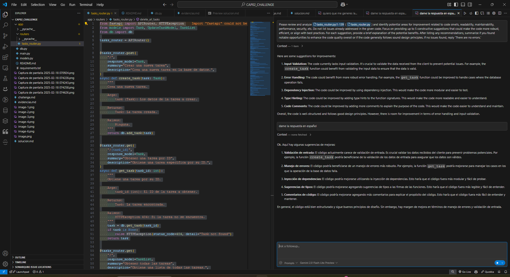
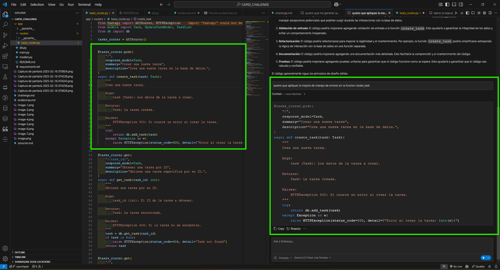

# Interacción con AI

## Explora

### Realizando preguntas a Cody para entender el contexto

Que hace esta app?

Que hace el archivo tasks_router.py?

Cual és son los diferentes endpoints y que hacen?

Como esta construida la base de datos?

Como se inicializa el aplicativo?

Pidiendo a Cody en un nuevo chat me explique que hace el archivo tasks_router.py

## Extiende

### Creando un nuevo endpoint para eliminar todos los registros de la base de datos

Con autocompletado

Creando el endpoint desde el chat y aplicando el codigo

### Documentando el modulo `app/routers/tasks_router.py`

## Corrige

### Code Smells

consultado las mejoras en el archivo tasks_router.py

Aplicando la mejora sugerida por Cody
